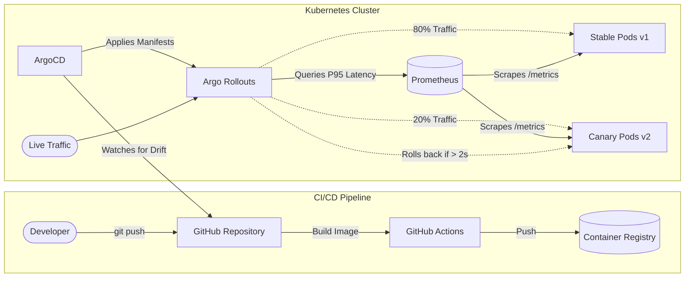
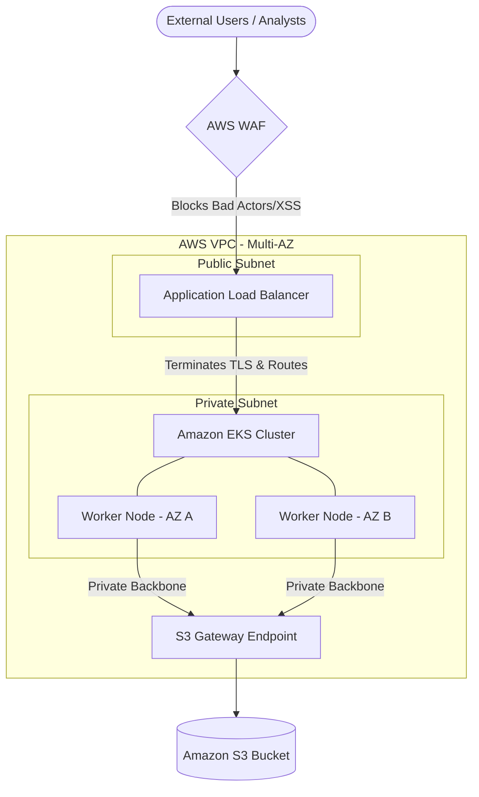

# GitOps MLOps Pipeline: Automated Canary Deployments

This repository demonstrates a production-grade MLOps deployment pipeline for a FastAPI-based Natural Language Processing (NLP) service. It utilizes GitOps principles to manage infrastructure and application state, featuring automated, metric-driven canary rollouts.

## Overlying Architecture

This project simulates a modern, cloud-native deployment lifecycle. The application is a FastAPI Python web service that utilizes SpaCy to perform named entity extraction. 

### GitOps Deployment Flow



The infrastructure relies on the following stack:
* **Kubernetes (k3d):** The local container orchestration platform.
* **ArgoCD:** The GitOps controller that continuously monitors this repository and syncs changes to the cluster.
* **Argo Rollouts:** A progressive delivery controller providing advanced deployment strategies (Canary).
* **Prometheus:** The time-series database scraping the FastAPI `/metrics` endpoint.
* **Automated Analysis:** Argo Rollouts queries Prometheus during deployments. If the P95 latency of the canary exceeds 2.0 seconds over a 1-minute lookback window, the rollout is automatically aborted and rolled back.

### The GitOps Workflow
1. A developer commits a code change or updates the Docker image tag in the Kubernetes manifests.
2. **ArgoCD** detects the configuration drift and applies the new manifests to the cluster.
3. **Argo Rollouts** intercepts the deployment and spins up a Canary (`v2`) alongside the Stable (`v1`) pods, routing 20% of live traffic to the Canary.
4. **Prometheus** tracks the HTTP latency of both versions.
5. If the Canary passes the latency thresholds, traffic is progressively shifted to 100%. If it fails, all traffic is instantly routed back to the Stable baseline.

---

## Local Cluster Setup

Ensure you have Docker, `k3d`, `kubectl`, and `make` installed on your machine.

**1. Provision the Cluster and Install Tooling**
Run the following make commands to spin up the k3d cluster, install the ArgoCD and Prometheus CRDs, and apply the initial GitOps bootstrap configuration:

```bash
make setup 
```

**2. Retrieve the ArgoCD Admin Password**

```bash
make get-argo-pass
```

*You can access the ArgoCD UI by port-forwarding the `argocd-server` service to your localhost.*

---

## Triggering the Canary Test

To demonstrate the metric-driven automated rollback, we will inject a bug into the application and watch the pipeline catch it.

**1. Establish Baseline Traffic**
Before deploying a change, the cluster needs live traffic to evaluate. Spin up an in-cluster traffic generator to simulate user requests:

```bash
make traffic
```

**2. Inject the Latency Bug**
In `app/main.py`, uncomment or add `time.sleep(3)` to the NLP extraction endpoint. Commit and push this change to your repository.

**3. Watch the Rollout**
Once GitHub Actions builds the new image and ArgoCD syncs the manifest, watch the progressive delivery controller in real-time:

```bash
kubectl argo rollouts get rollout nlp-api --watch

```

**The Result:** Argo Rollouts will route a percentage of the generated traffic to the new pod. Prometheus will detect that the `p95-latency` metric has spiked above the 2.0-second threshold. The `AnalysisRun` will fail, the buggy pod will be terminated, and 100% of traffic will be safely routed back to the stable baseline without manual intervention.

---

## ☁️ Production Expansion: AWS Migration Architecture

While this project utilizes a local k3d cluster for development, the architecture is designed to map directly to enterprise AWS environments adhering to zero-trust and defense-grade security standards.



To migrate this to production, we would implement the following AWS topology:

### 1. Network Foundation (VPC)

* **Multi-AZ EKS:** The Kubernetes cluster runs on Amazon EKS across multiple Availability Zones in private subnets. EKS worker nodes are completely isolated from the public internet.
* **S3 Gateway Endpoints:** For the NLP model to securely download large training datasets, Gateway Endpoints are injected into the private route tables, funneling S3 traffic through the AWS backbone and bypassing the public internet entirely to meet strict compliance mandates.

### 2. Secure CI/CD Supply Chain

* **OIDC Authentication:** GitHub Actions assumes an AWS IAM Role via OpenID Connect (OIDC). No static, long-lived AWS Access Keys are stored in the repository.
* **Amazon ECR Scan-on-Push:** Docker images are pushed to Elastic Container Registry (ECR). The pipeline is configured to fail if ECR's Clair engine detects critical CVEs in the base image, preventing vulnerable code from ever reaching the cluster.

### 3. Application Security & Ingress

* **AWS WAF (Web Application Firewall):** Positioned at the cloud perimeter, WAF inspects all incoming payloads for OWASP threats (like XSS or SQLi) and enforces Geo-blocking before traffic reaches the VPC.
* **Application Load Balancer (ALB):** Living in the public subnet, the ALB terminates SSL/TLS and safely bridges traffic to the EKS Ingress controller in the private subnet.

### 4. Infrastructure as Code (IaC)

* **Terraform:** The entire AWS environment (VPCs, EKS, ECR, IAM Roles) is provisioned declaratively using Terraform.
* **Modular Design:** Regional deployments are templated using Terraform modules, with state securely isolated via S3 remote backends and DynamoDB state locking to minimize deployment blast radius.
* **IRSA (IAM Roles for Service Accounts):** Applying the principle of least privilege, specific AWS IAM Roles are mapped directly to the FastAPI Kubernetes Pods, rather than the underlying EC2 worker nodes.

